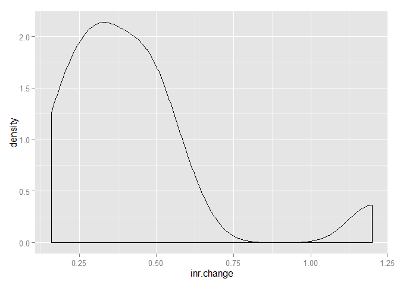
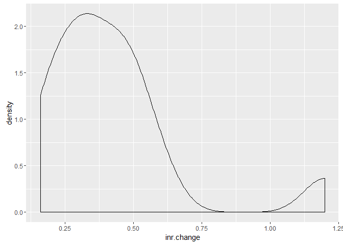
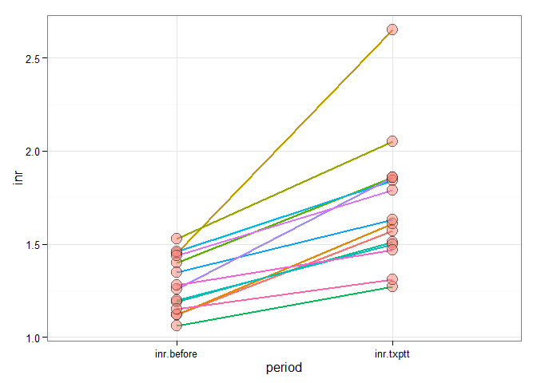
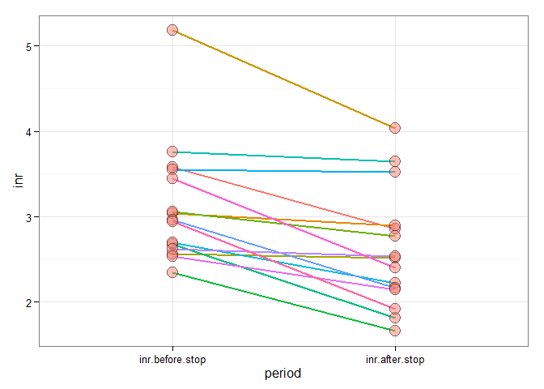
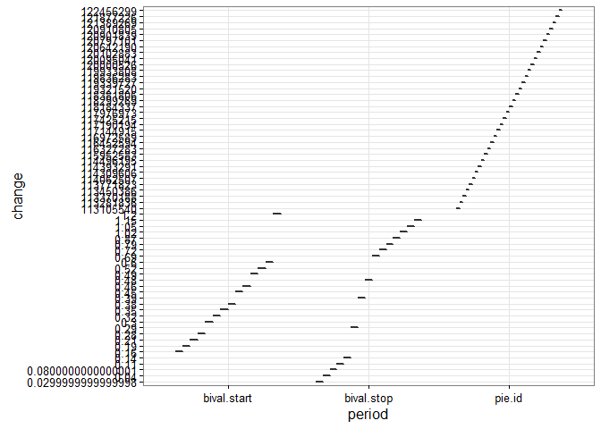
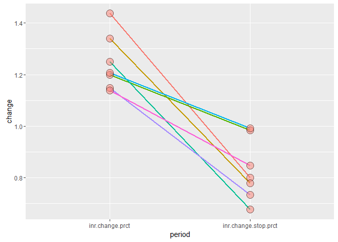
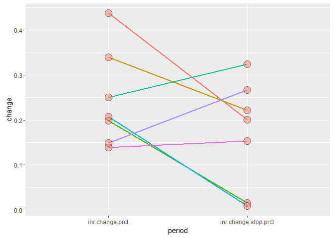
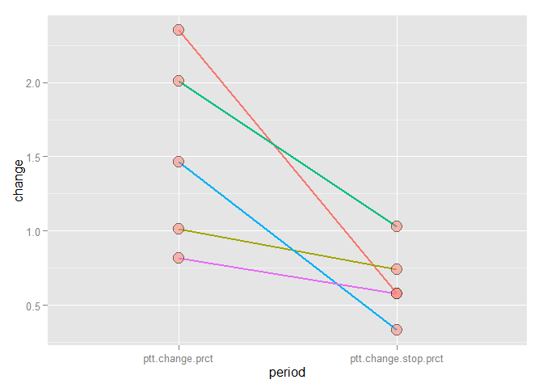
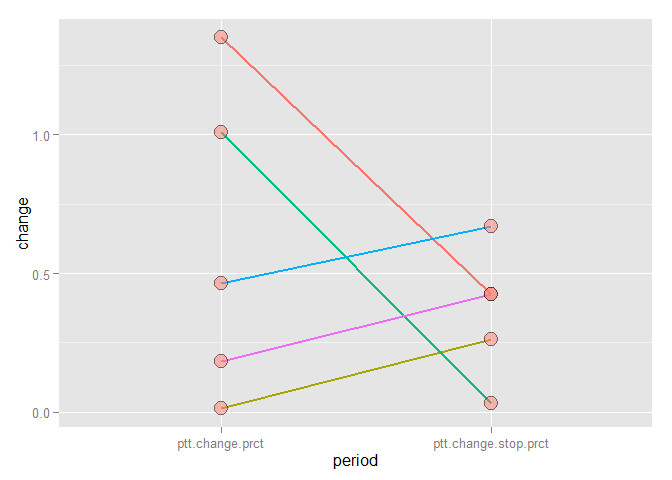

# Exploratory Analysis
Andrea Fetea, Brian Gulbis, Christie Hall  
`r format(Sys.Date(), "%B %d, %Y")`  


## Patients

* Patients receiving bivalirudin: 491
* Patients receiving warfarin: 238
* Patients with at least one overlapping dose: 108
* Patients meeting inclusion criteria: 76
* Patients excluded:
    - Alternate anticoagulant during transition interval: 5
    - Bleeding within 48 hours prior to bivalirudin: 3
    - Diagnosis of liver disease or hypercoaguable condidtion: 3
    - INR >1.5 at time of bivalirudin initiation: 21
    - Vitamin K with 5 days of bivalirudin: 1
    - Thrombolytics within 48 hours of bivalirudin: 9
    - Major inducers: 0
    - Pregnant: 0
* Patients included in study: 34

### Exclusion Criteria Variables

* Hours of bivalirudin and warfarin overlap: 72
* Days prior to bivalirudin with an INR < 1.5: 1

## Demographics


  * **age**:

    -------------------------------------------------------------------
     n   nvalid   mean   sd   min   Q1    median   Q3   max   percZero
    --- -------- ------ ---- ----- ----- -------- ---- ----- ----------
    34     34    61.03  11.7  26   54.25    61     69   79       0
    -------------------------------------------------------------------

  * **sex**:

    --------------------------
       &nbsp;     freq   perc
    ------------ ------ ------
     **Female**    13   38.24

      **Male**     21   61.76

     **Total**     34    100
    --------------------------

  * **race**:

    ------------------------------------
            &nbsp;          freq   perc
    ---------------------- ------ ------
     **African American**    12   35.29

          **Asian**          0      0

        **Native Am.**       0      0

          **Other**          4    11.76

         **Unknown**         2     5.88

     **White/Caucasian**     16   47.06

          **Total**          34   99.99
    ------------------------------------

  * **los**:

    --------------------------------------------------------------------
     n   nvalid   mean   sd    min   Q1   median   Q3    max   percZero
    --- -------- ------ ----- ----- ---- -------- ----- ----- ----------
    34     34     30.8  21.41 6.88  17.7  26.82   33.56  108      0
    --------------------------------------------------------------------

  * **disposition**:

    ----------------------------------------------
                 &nbsp;               freq   perc
    -------------------------------- ------ ------
             **Acute Care**            0      0

       **Against Medical Advise**      0      0

        **DC TO HOME/SELF CARE**       0      0

          **DC/DISC TO REHAB**         9    26.47

        **DC/TF-Cancer/Childre**       0      0

              **Deceased**             0      0

     **Discharged to Hospice-Home**    0      0

            **Discharged to            0      0
       Hospice-Medical Facility**

                **Home**               11   32.35

     **Home Care with Home Health**    7    20.59

         **Intermediate Care**         1     2.94

           **Long Term Care**          3     8.82

      **Skilled Nursing Facility**     3     8.82

               **Total**               34   99.99
    ----------------------------------------------

  * **bival.duration**:

    ---------------------------------------------------------------------
     n   nvalid   mean   sd    min   Q1    median   Q3    max   percZero
    --- -------- ------ ----- ----- ----- -------- ----- ----- ----------
    34     34    12.58  11.74 4.824 6.716  8.927   11.77 61.89     0
    ---------------------------------------------------------------------

  * **bival.prior.warf**:

    -----------------------------------------------------------------------
     n   nvalid   mean   sd     min    Q1    median   Q3    max   percZero
    --- -------- ------ ----- ------- ----- -------- ----- ----- ----------
    34     34    6.089  10.76 0.06111 1.782   3.2    5.186 55.18     0
    -----------------------------------------------------------------------

  * **overlap**:

    --------------------------------------------------------------------
     n   nvalid   mean   sd   min   Q1    median   Q3    max   percZero
    --- -------- ------ ---- ----- ----- -------- ----- ----- ----------
    34     34     6.49  5.27 3.03  3.733  5.176   7.512 33.16     0
    --------------------------------------------------------------------

  * **height**:

    ---------------------------------------------------------------------
     n   nvalid   mean   sd    min   Q1    median   Q3    max   percZero
    --- -------- ------ ----- ----- ----- -------- ----- ----- ----------
    34     34    172.5  9.635 152.4 165.7  172.7   180.3  188      0
    ---------------------------------------------------------------------

  * **weight**:

    ---------------------------------------------------------------------
     n   nvalid   mean   sd    min   Q1    median   Q3    max   percZero
    --- -------- ------ ----- ----- ----- -------- ----- ----- ----------
    34     34     95.4  26.65 55.5  77.73   88.6   109.2 187.1     0
    ---------------------------------------------------------------------

  * **proc.48hrs**:

    -------------------------
      &nbsp;     freq   perc
    ----------- ------ ------
     **FALSE**    18   52.94

     **TRUE**     16   47.06

     **Total**    34    100
    -------------------------


<!-- end of list -->

## Diagnosis


  * **anemia**:

    -------------------------
      &nbsp;     freq   perc
    ----------- ------ ------
     **FALSE**    22   64.71

     **TRUE**     12   35.29

     **Total**    34    100
    -------------------------

  * **anticoag.chronic**:

    -------------------------
      &nbsp;     freq   perc
    ----------- ------ ------
     **FALSE**    30   88.24

     **TRUE**     4    11.76

     **Total**    34    100
    -------------------------

  * **aortic.plaque**:

    -------------------------
      &nbsp;     freq   perc
    ----------- ------ ------
     **FALSE**    34    100

     **Total**    34    100
    -------------------------

  * **arf**:

    -------------------------
      &nbsp;     freq   perc
    ----------- ------ ------
     **FALSE**    14   41.18

     **TRUE**     20   58.82

     **Total**    34    100
    -------------------------

  * **atrial.fib**:

    -------------------------
      &nbsp;     freq   perc
    ----------- ------ ------
     **FALSE**    20   58.82

     **TRUE**     14   41.18

     **Total**    34    100
    -------------------------

  * **atrial.flutter**:

    -------------------------
      &nbsp;     freq   perc
    ----------- ------ ------
     **FALSE**    29   85.29

     **TRUE**     5    14.71

     **Total**    34    100
    -------------------------

  * **avm**:

    -------------------------
      &nbsp;     freq   perc
    ----------- ------ ------
     **FALSE**    34    100

     **Total**    34    100
    -------------------------

  * **bleed.cns**:

    -------------------------
      &nbsp;     freq   perc
    ----------- ------ ------
     **FALSE**    31   91.18

     **TRUE**     3     8.82

     **Total**    34    100
    -------------------------

  * **bleed.gi**:

    -------------------------
      &nbsp;     freq   perc
    ----------- ------ ------
     **FALSE**    33   97.06

     **TRUE**     1     2.94

     **Total**    34    100
    -------------------------

  * **bleed.major**:

    -------------------------
      &nbsp;     freq   perc
    ----------- ------ ------
     **FALSE**    30   88.24

     **TRUE**     4    11.76

     **Total**    34    100
    -------------------------

  * **bleed.minor**:

    -------------------------
      &nbsp;     freq   perc
    ----------- ------ ------
     **FALSE**    32   94.12

     **TRUE**     2     5.88

     **Total**    34    100
    -------------------------

  * **cancer**:

    -------------------------
      &nbsp;     freq   perc
    ----------- ------ ------
     **FALSE**    32   94.12

     **TRUE**     2     5.88

     **Total**    34    100
    -------------------------

  * **ckd**:

    -------------------------
      &nbsp;     freq   perc
    ----------- ------ ------
     **FALSE**    27   79.41

     **TRUE**     7    20.59

     **Total**    34    100
    -------------------------

  * **copd**:

    -------------------------
      &nbsp;     freq   perc
    ----------- ------ ------
     **FALSE**    30   88.24

     **TRUE**     4    11.76

     **Total**    34    100
    -------------------------

  * **dvt.acute**:

    -------------------------
      &nbsp;     freq   perc
    ----------- ------ ------
     **FALSE**    21   61.76

     **TRUE**     13   38.24

     **Total**    34    100
    -------------------------

  * **dvt.chronic**:

    -------------------------
      &nbsp;     freq   perc
    ----------- ------ ------
     **FALSE**    33   97.06

     **TRUE**     1     2.94

     **Total**    34    100
    -------------------------

  * **dvt.ob**:

    -------------------------
      &nbsp;     freq   perc
    ----------- ------ ------
     **FALSE**    34    100

     **Total**    34    100
    -------------------------

  * **esoph.var**:

    -------------------------
      &nbsp;     freq   perc
    ----------- ------ ------
     **FALSE**    28   82.35

     **TRUE**     6    17.65

     **Total**    34    100
    -------------------------

  * **esrd**:

    -------------------------
      &nbsp;     freq   perc
    ----------- ------ ------
     **FALSE**    28   82.35

     **TRUE**     6    17.65

     **Total**    34    100
    -------------------------

  * **gi.ulcer**:

    -------------------------
      &nbsp;     freq   perc
    ----------- ------ ------
     **FALSE**    32   94.12

     **TRUE**     2     5.88

     **Total**    34    100
    -------------------------

  * **hemophil**:

    -------------------------
      &nbsp;     freq   perc
    ----------- ------ ------
     **FALSE**    34    100

     **Total**    34    100
    -------------------------

  * **hepatitis**:

    -------------------------
      &nbsp;     freq   perc
    ----------- ------ ------
     **FALSE**    34    100

     **Total**    34    100
    -------------------------

  * **hit**:

    -------------------------
      &nbsp;     freq   perc
    ----------- ------ ------
     **FALSE**    26   76.47

     **TRUE**     8    23.53

     **Total**    34    100
    -------------------------

  * **hypercoag**:

    -------------------------
      &nbsp;     freq   perc
    ----------- ------ ------
     **FALSE**    34    100

     **Total**    34    100
    -------------------------

  * **lv.thrombus**:

    -------------------------
      &nbsp;     freq   perc
    ----------- ------ ------
     **FALSE**    34    100

     **Total**    34    100
    -------------------------

  * **neph.synd**:

    -------------------------
      &nbsp;     freq   perc
    ----------- ------ ------
     **FALSE**    34    100

     **Total**    34    100
    -------------------------

  * **parox.noct.hgb**:

    -------------------------
      &nbsp;     freq   perc
    ----------- ------ ------
     **FALSE**    34    100

     **Total**    34    100
    -------------------------

  * **pe.acute**:

    -------------------------
      &nbsp;     freq   perc
    ----------- ------ ------
     **FALSE**    26   76.47

     **TRUE**     8    23.53

     **Total**    34    100
    -------------------------

  * **pe.chronic**:

    -------------------------
      &nbsp;     freq   perc
    ----------- ------ ------
     **FALSE**    34    100

     **Total**    34    100
    -------------------------

  * **pe.ob**:

    -------------------------
      &nbsp;     freq   perc
    ----------- ------ ------
     **FALSE**    34    100

     **Total**    34    100
    -------------------------

  * **phlebitis**:

    -------------------------
      &nbsp;     freq   perc
    ----------- ------ ------
     **FALSE**    17     50

     **TRUE**     17     50

     **Total**    34    100
    -------------------------

  * **plasmin.def**:

    -------------------------
      &nbsp;     freq   perc
    ----------- ------ ------
     **FALSE**    34    100

     **Total**    34    100
    -------------------------

  * **pvd**:

    -------------------------
      &nbsp;     freq   perc
    ----------- ------ ------
     **FALSE**    33   97.06

     **TRUE**     1     2.94

     **Total**    34    100
    -------------------------

  * **short.gut**:

    -------------------------
      &nbsp;     freq   perc
    ----------- ------ ------
     **FALSE**    34    100

     **Total**    34    100
    -------------------------

  * **sickle.cell**:

    -------------------------
      &nbsp;     freq   perc
    ----------- ------ ------
     **FALSE**    34    100

     **Total**    34    100
    -------------------------

  * **stroke**:

    -------------------------
      &nbsp;     freq   perc
    ----------- ------ ------
     **FALSE**    30   88.24

     **TRUE**     4    11.76

     **Total**    34    100
    -------------------------

  * **tia**:

    -------------------------
      &nbsp;     freq   perc
    ----------- ------ ------
     **FALSE**    34    100

     **Total**    34    100
    -------------------------

  * **ulcer.colitis**:

    -------------------------
      &nbsp;     freq   perc
    ----------- ------ ------
     **FALSE**    34    100

     **Total**    34    100
    -------------------------


<!-- end of list -->

### Anticoagulation Indications

As specified in the warfarin goals


  * **afib**:

    -------------------------
      &nbsp;     freq   perc
    ----------- ------ ------
     **FALSE**    26   76.47

     **TRUE**     8    23.53

     **Total**    34    100
    -------------------------

  * **dvt**:

    -------------------------
      &nbsp;     freq   perc
    ----------- ------ ------
     **FALSE**    28   82.35

     **TRUE**     6    17.65

     **Total**    34    100
    -------------------------

  * **pe**:

    -------------------------
      &nbsp;     freq   perc
    ----------- ------ ------
     **FALSE**    26   76.47

     **TRUE**     8    23.53

     **Total**    34    100
    -------------------------

  * **valve**:

    -------------------------
      &nbsp;     freq   perc
    ----------- ------ ------
     **FALSE**    31   91.18

     **TRUE**     3     8.82

     **Total**    34    100
    -------------------------

  * **other**:

    -------------------------
      &nbsp;     freq   perc
    ----------- ------ ------
     **FALSE**    20   58.82

     **TRUE**     14   41.18

     **Total**    34    100
    -------------------------


<!-- end of list -->

### Bleeding


  * **hgb.drop**:

    -----------------------------------------------------------------------
     n   nvalid   mean   sd    min    Q1    median    Q3    max   percZero
    --- -------- ------ ----- ----- ------ -------- ------ ----- ----------
     2     2     -3.55  1.061 -4.3  -3.925  -3.55   -3.175 -2.8      0
    -----------------------------------------------------------------------

  * **bival.drop.diff**:

    --------------------------------------------------------------------
     n   nvalid   mean   sd   min   Q1    median   Q3    max   percZero
    --- -------- ------ ---- ----- ----- -------- ----- ----- ----------
     2     2     72.38  19.8 58.38 65.38  72.38   79.38 86.38     0
    --------------------------------------------------------------------

  * **warf.drop.diff**:

    -------------------------------------------------------------------------
     n   nvalid   mean    sd    min     Q1    median   Q3    max    percZero
    --- -------- ------ ------ ------ ------ -------- ----- ------ ----------
     2     2     -63.23 0.0825 -63.28 -63.25  -63.22  -63.2 -63.17     0
    -------------------------------------------------------------------------


<!-- end of list -->

## Baseline Labs

Most recent lab value prior to bivalirudin initiation (except for the heparin antibody ELISA, which could have been performed at any time)


  * **scr**:

    --------------------------------------------------------------------
     n   nvalid   mean   sd    min   Q1   median   Q3    max   percZero
    --- -------- ------ ----- ----- ---- -------- ----- ----- ----------
    34     32    1.831  1.866  0.6   1     1.3    1.975 11.1      0
    --------------------------------------------------------------------

  * **ast**:

    ---------------------------------------------------------------------
     n   nvalid   mean   sd    min   Q1    median   Q3    max   percZero
    --- -------- ------ ----- ----- ----- -------- ----- ----- ----------
    34     30      71   69.32  16   30.25    55    76.75  356      0
    ---------------------------------------------------------------------

  * **alt**:

    --------------------------------------------------------------------
     n   nvalid   mean   sd    min   Q1   median   Q3    max   percZero
    --- -------- ------ ----- ----- ---- -------- ----- ----- ----------
    34     30    76.37  109.8  18   26.5    51    62.75  562      0
    --------------------------------------------------------------------

  * **t.bili**:

    --------------------------------------------------------------------
     n   nvalid   mean   sd    min   Q1    median   Q3   max   percZero
    --- -------- ------ ----- ----- ----- -------- ---- ----- ----------
    34     30     1.5   2.366  0.2  0.425   0.85   1.45 13.2      0
    --------------------------------------------------------------------

  * **crcl**:

    ---------------------------------------------------------------------
     n   nvalid   mean   sd    min   Q1    median   Q3    max   percZero
    --- -------- ------ ----- ----- ----- -------- ----- ----- ----------
    34     32     52.6  27.47 6.625 27.55  58.91   71.59  116      0
    ---------------------------------------------------------------------

  * **elisa**:

    ----------------------------
        &nbsp;      freq   perc
    -------------- ------ ------
     **Negative**    8    29.63

     **Positive**    19   70.37

      **Total**      27    100
    ----------------------------


<!-- end of list -->

## Serial Lab Values

Summary of labs from 48 hours prior to bivalirudin initiation to 5 days after bival cesation


  * **hct**:

      * **first**:

        ---------------------------------------------------------------------
         n   nvalid   mean   sd    min   Q1    median   Q3    max   percZero
        --- -------- ------ ----- ----- ----- -------- ----- ----- ----------
        34     34     29.4  5.344 22.3  24.68   29.1   33.28 39.9      0
        ---------------------------------------------------------------------

      * **last**:

        --------------------------------------------------------------------
         n   nvalid   mean   sd   min   Q1    median   Q3    max   percZero
        --- -------- ------ ---- ----- ----- -------- ----- ----- ----------
        34     34    28.82  3.87 22.3  25.78   28.6   30.75 38.6      0
        --------------------------------------------------------------------

      * **change**:

        ---------------------------------------------------------------------
         n   nvalid   mean    sd   min    Q1    median   Q3   max   percZero
        --- -------- ------- ---- ----- ------ -------- ---- ----- ----------
        34     34    -0.5765 5.23  -15  -2.325   0.85   1.85  8.3    2.941
        ---------------------------------------------------------------------

      * **change.prct**:

        ------------------------------------------------------------------------
         n   nvalid   mean    sd    min     Q1    median   Q3    max   percZero
        --- -------- ------ ------ ------ ------ -------- ----- ----- ----------
        34     34    1.002  0.1648 0.6241 0.9217   1.03   1.065 1.332     0
        ------------------------------------------------------------------------

      * **min**:

        -------------------------------------------------------------------
         n   nvalid   mean   sd    min   Q1   median   Q3   max   percZero
        --- -------- ------ ----- ----- ---- -------- ---- ----- ----------
        34     33    24.79  4.596 14.8  21.8   24.1   27.7 36.4      0
        -------------------------------------------------------------------

      * **min.prct**:

        -------------------------------------------------------------------------
         n   nvalid   mean    sd    min     Q1    median    Q3    max   percZero
        --- -------- ------ ------ ------ ------ -------- ------ ----- ----------
        34     33    0.8612 0.1273 0.5068 0.8064  0.9049  0.9505   1       0
        -------------------------------------------------------------------------

      * **max**:

        -------------------------------------------------------------------
         n   nvalid   mean   sd    min   Q1   median   Q3   max   percZero
        --- -------- ------ ----- ----- ---- -------- ---- ----- ----------
        34     33    32.85  4.839 24.4  30.4   31.9   35.3 45.8      0
        -------------------------------------------------------------------

      * **max.prct**:

        ---------------------------------------------------------------------
         n   nvalid   mean    sd    min   Q1    median   Q3   max   percZero
        --- -------- ------ ------ ----- ----- -------- ---- ----- ----------
        34     33    1.143  0.1475   1   1.029  1.094   1.24 1.514     0
        ---------------------------------------------------------------------

      * **auc**:

        -------------------------------------------------------------------
         n   nvalid   mean   sd   min   Q1   median   Q3    max   percZero
        --- -------- ------ ---- ----- ---- -------- ----- ----- ----------
        34     34    11179  8838 4423  7095   8692   10640 48840     0
        -------------------------------------------------------------------

      * **time.wt.avg**:

        --------------------------------------------------------------------
         n   nvalid   mean   sd   min   Q1    median   Q3    max   percZero
        --- -------- ------ ---- ----- ----- -------- ----- ----- ----------
        34     34    28.88  3.85 23.1  25.93  28.04   31.36 39.88     0
        --------------------------------------------------------------------


  * **hgb**:

      * **first**:

        -------------------------------------------------------------------
         n   nvalid   mean   sd    min   Q1   median   Q3   max   percZero
        --- -------- ------ ----- ----- ---- -------- ---- ----- ----------
        34     34    9.568  1.679  7.3  8.05   9.5    10.6 13.3      0
        -------------------------------------------------------------------

      * **last**:

        --------------------------------------------------------------------
         n   nvalid   mean   sd    min   Q1   median   Q3    max   percZero
        --- -------- ------ ----- ----- ---- -------- ----- ----- ----------
        34     34    9.409  1.283  7.5  8.4    9.4    10.25 12.7      0
        --------------------------------------------------------------------

      * **change**:

        -----------------------------------------------------------------------
         n   nvalid   mean    sd    min    Q1    median   Q3    max   percZero
        --- -------- ------- ----- ----- ------ -------- ----- ----- ----------
        34     34    -0.1588 1.696 -5.2  -0.825   0.3    0.675  2.6    2.941
        -----------------------------------------------------------------------

      * **change.prct**:

        -----------------------------------------------------------------------
         n   nvalid   mean    sd    min    Q1    median   Q3    max   percZero
        --- -------- ------ ------ ----- ------ -------- ----- ----- ----------
        34     34    1.003  0.1619 0.609 0.9139  1.035   1.078 1.315     0
        -----------------------------------------------------------------------

      * **min**:

        -------------------------------------------------------------------
         n   nvalid   mean   sd    min   Q1   median   Q3   max   percZero
        --- -------- ------ ----- ----- ---- -------- ---- ----- ----------
        34     33    8.048  1.505  4.8   7     7.8     9   12.3      0
        -------------------------------------------------------------------

      * **min.prct**:

        -------------------------------------------------------------------------
         n   nvalid   mean    sd    min     Q1    median    Q3    max   percZero
        --- -------- ------ ------ ------ ------ -------- ------ ----- ----------
        34     33    0.8591 0.1292 0.4848 0.7925  0.9053  0.9474   1       0
        -------------------------------------------------------------------------

      * **max**:

        -------------------------------------------------------------------
         n   nvalid   mean   sd    min   Q1   median   Q3   max   percZero
        --- -------- ------ ----- ----- ---- -------- ---- ----- ----------
        34     33    10.72  1.501   8    10    10.5   11.5  15       0
        -------------------------------------------------------------------

      * **max.prct**:

        ---------------------------------------------------------------------
         n   nvalid   mean    sd    min   Q1    median   Q3   max   percZero
        --- -------- ------ ------ ----- ----- -------- ---- ----- ----------
        34     33    1.146  0.1434   1   1.065  1.084   1.23 1.425     0
        ---------------------------------------------------------------------

      * **auc**:

        ------------------------------------------------------------------
         n   nvalid   mean   sd   min   Q1   median   Q3   max   percZero
        --- -------- ------ ---- ----- ---- -------- ---- ----- ----------
        34     34     3622  2771 1473  2319   2745   3517 15280     0
        ------------------------------------------------------------------

      * **time.wt.avg**:

        ---------------------------------------------------------------------
         n   nvalid   mean   sd    min   Q1    median   Q3    max   percZero
        --- -------- ------ ----- ----- ----- -------- ----- ----- ----------
        34     34     9.42  1.213 7.683 8.471  9.306   10.18 13.19     0
        ---------------------------------------------------------------------


  * **inr**:

      * **first**:

        ----------------------------------------------------------------------
         n   nvalid   mean    sd    min   Q1    median   Q3    max   percZero
        --- -------- ------ ------ ----- ----- -------- ----- ----- ----------
        34     34     1.37  0.3685 0.98  1.172  1.305   1.435  2.8      0
        ----------------------------------------------------------------------

      * **last**:

        ----------------------------------------------------------------------
         n   nvalid   mean    sd    min   Q1    median   Q3    max   percZero
        --- -------- ------ ------ ----- ----- -------- ----- ----- ----------
        34     34    2.334  0.5238 1.26  1.947   2.3    2.698  3.4      0
        ----------------------------------------------------------------------

      * **change**:

        -----------------------------------------------------------------------
         n   nvalid   mean    sd    min    Q1    median   Q3    max   percZero
        --- -------- ------ ------ ----- ------ -------- ----- ----- ----------
        34     34    0.9644 0.6841 -1.28 0.5925  1.055   1.248 1.96      0
        -----------------------------------------------------------------------

      * **change.prct**:

        ----------------------------------------------------------------------
         n   nvalid   mean   sd    min    Q1    median   Q3    max   percZero
        --- -------- ------ ----- ------ ----- -------- ----- ----- ----------
        34     34    1.789  0.502 0.4961 1.502  1.822   2.114 2.735     0
        ----------------------------------------------------------------------

      * **min**:

        ----------------------------------------------------------------------
         n   nvalid   mean    sd    min   Q1    median   Q3    max   percZero
        --- -------- ------ ------ ----- ----- -------- ----- ----- ----------
        34     34    1.235  0.1793 0.98  1.112  1.185   1.325 1.94      0
        ----------------------------------------------------------------------

      * **min.prct**:

        -----------------------------------------------------------------------
         n   nvalid   mean    sd    min     Q1    median   Q3   max   percZero
        --- -------- ------ ------ ------ ------ -------- ---- ----- ----------
        34     34    0.9253 0.1108 0.4843 0.8901  0.9667   1     1       0
        -----------------------------------------------------------------------

      * **max**:

        ---------------------------------------------------------------------
         n   nvalid   mean   sd    min   Q1    median   Q3    max   percZero
        --- -------- ------ ----- ----- ----- -------- ----- ----- ----------
        34     34    3.583  1.095 2.07  2.902   3.39   3.938 7.18      0
        ---------------------------------------------------------------------

      * **max.prct**:

        ----------------------------------------------------------------------
         n   nvalid   mean    sd    min   Q1    median   Q3    max   percZero
        --- -------- ------ ------ ----- ----- -------- ----- ----- ----------
        34     34    2.728  0.9458 1.164 2.127  2.662   3.055 5.885     0
        ----------------------------------------------------------------------

      * **auc**:

        --------------------------------------------------------------------
         n   nvalid   mean   sd    min   Q1   median   Q3    max   percZero
        --- -------- ------ ----- ----- ---- -------- ----- ----- ----------
        34     34    705.8  458.1 291.3 419   551.7   761.3 2248      0
        --------------------------------------------------------------------

      * **time.wt.avg**:

        ----------------------------------------------------------------------
         n   nvalid   mean    sd    min   Q1    median   Q3    max   percZero
        --- -------- ------ ------ ----- ----- -------- ----- ----- ----------
        34     34    1.915  0.3052 1.434 1.734  1.863   2.107 2.524     0
        ----------------------------------------------------------------------


  * **platelet**:

      * **first**:

        ---------------------------------------------------------------------
         n   nvalid   mean   sd    min   Q1    median   Q3    max   percZero
        --- -------- ------ ----- ----- ----- -------- ----- ----- ----------
        34     34    156.4  101.6  20   85.25  124.5   216.5  544      0
        ---------------------------------------------------------------------

      * **last**:

        ---------------------------------------------------------------------
         n   nvalid   mean   sd    min   Q1    median   Q3    max   percZero
        --- -------- ------ ----- ----- ----- -------- ----- ----- ----------
        34     34    253.4  110.2  64   194.5   239    285.2  626      0
        ---------------------------------------------------------------------

      * **change**:

        -------------------------------------------------------------------
         n   nvalid   mean   sd    min   Q1   median   Q3   max   percZero
        --- -------- ------ ----- ----- ---- -------- ---- ----- ----------
        34     34    96.97  157.9 -404   20     82    167   526      0
        -------------------------------------------------------------------

      * **change.prct**:

        ---------------------------------------------------------------------
         n   nvalid   mean   sd    min    Q1   median   Q3    max   percZero
        --- -------- ------ ----- ------ ---- -------- ----- ----- ----------
        34     34    2.485  2.595 0.2574 1.09  1.776   2.827 14.35     0
        ---------------------------------------------------------------------

      * **min**:

        -------------------------------------------------------------------
         n   nvalid   mean   sd    min   Q1   median   Q3   max   percZero
        --- -------- ------ ----- ----- ---- -------- ---- ----- ----------
        34     33    117.5  69.79  15    66    100    186   245      0
        -------------------------------------------------------------------

      * **min.prct**:

        -----------------------------------------------------------------------
         n   nvalid   mean    sd    min     Q1    median   Q3   max   percZero
        --- -------- ------ ------ ------ ------ -------- ---- ----- ----------
        34     33    0.7933 0.2536 0.1545 0.6917  0.9367   1     1       0
        -----------------------------------------------------------------------

      * **max**:

        -------------------------------------------------------------------
         n   nvalid   mean   sd    min   Q1   median   Q3   max   percZero
        --- -------- ------ ----- ----- ---- -------- ---- ----- ----------
        34     33    312.8  122.9  140  236    291    351   660      0
        -------------------------------------------------------------------

      * **max.prct**:

        ---------------------------------------------------------------------
         n   nvalid   mean   sd    min   Q1    median   Q3    max   percZero
        --- -------- ------ ----- ----- ----- -------- ----- ----- ----------
        34     33    3.199  4.377   1   1.339  2.132   3.198  26       0
        ---------------------------------------------------------------------

      * **auc**:

        -----------------------------------------------------------------------
         n   nvalid   mean   sd    min   Q1    median    Q3    max    percZero
        --- -------- ------ ----- ----- ----- -------- ------ ------ ----------
        34     34    75625  37009 36600 46610  60320   107200 161000     0
        -----------------------------------------------------------------------

      * **time.wt.avg**:

        ---------------------------------------------------------------------
         n   nvalid   mean   sd    min   Q1    median   Q3    max   percZero
        --- -------- ------ ----- ----- ----- -------- ----- ----- ----------
        34     34    220.5  77.04 100.3 167.7  210.1   254.9 383.2     0
        ---------------------------------------------------------------------


  * **ptt**:

      * **first**:

        ---------------------------------------------------------------------
         n   nvalid   mean   sd    min   Q1    median   Q3    max   percZero
        --- -------- ------ ----- ----- ----- -------- ----- ----- ----------
        34     34    49.91  25.11 23.2  34.67  39.65   61.82 160.1     0
        ---------------------------------------------------------------------

      * **last**:

        --------------------------------------------------------------------
         n   nvalid   mean   sd    min   Q1    median   Q3   max   percZero
        --- -------- ------ ----- ----- ----- -------- ---- ----- ----------
        34     34    56.01  17.61 29.8  41.82  53.05   67.2 92.8      0
        --------------------------------------------------------------------

      * **change**:

        -----------------------------------------------------------------------
         n   nvalid   mean   sd    min     Q1    median   Q3    max   percZero
        --- -------- ------ ----- ------ ------ -------- ----- ----- ----------
        34     34    6.091  32.26 -124.5 -7.775   9.05   26.65 53.2      0
        -----------------------------------------------------------------------

      * **change.prct**:

        ------------------------------------------------------------------------
         n   nvalid   mean    sd    min     Q1    median   Q3    max   percZero
        --- -------- ------ ------ ------ ------ -------- ----- ----- ----------
        34     34    1.302  0.5535 0.2224 0.8702  1.228   1.787 2.343     0
        ------------------------------------------------------------------------

      * **min**:

        ---------------------------------------------------------------------
         n   nvalid   mean   sd    min   Q1    median   Q3    max   percZero
        --- -------- ------ ----- ----- ----- -------- ----- ----- ----------
        34     32    33.98  6.915 18.4  30.12  34.05   38.82 57.1      0
        ---------------------------------------------------------------------

      * **min.prct**:

        -----------------------------------------------------------------------
         n   nvalid   mean    sd    min     Q1    median   Q3   max   percZero
        --- -------- ------ ------ ------ ------ -------- ---- ----- ----------
        34     32    0.7855 0.2358 0.2224 0.5653  0.8916   1     1       0
        -----------------------------------------------------------------------

      * **max**:

        --------------------------------------------------------------------
         n   nvalid   mean   sd    min   Q1   median   Q3    max   percZero
        --- -------- ------ ----- ----- ---- -------- ----- ----- ----------
        34     32    110.3  27.74 80.8   90   97.05   123.1 180.4     0
        --------------------------------------------------------------------

      * **max.prct**:

        --------------------------------------------------------------------
         n   nvalid   mean   sd    min   Q1   median   Q3    max   percZero
        --- -------- ------ ----- ----- ---- -------- ----- ----- ----------
        34     32    2.575  1.007   1   1.89  2.592   3.118 5.418     0
        --------------------------------------------------------------------

      * **auc**:

        ----------------------------------------------------------------------
         n   nvalid   mean   sd    min   Q1    median   Q3    max    percZero
        --- -------- ------ ----- ----- ----- -------- ----- ------ ----------
        34     34    24068  18342 10410 14920  18240   24240 101900     0
        ----------------------------------------------------------------------

      * **time.wt.avg**:

        ---------------------------------------------------------------------
         n   nvalid   mean   sd    min   Q1    median   Q3    max   percZero
        --- -------- ------ ----- ----- ----- -------- ----- ----- ----------
        34     34    63.86  6.568 46.55 59.96  64.75   67.71 76.46     0
        ---------------------------------------------------------------------


<!-- end of list -->

## Bivalirudin Infusion


  * **first.rate**:

    ----------------------------------------------------------------------
     n   nvalid   mean     sd     min   Q1   median   Q3   max   percZero
    --- -------- ------- ------- ----- ---- -------- ---- ----- ----------
    34     34    0.09324 0.05079 0.02  0.05  0.065   0.15 0.15      0
    ----------------------------------------------------------------------

  * **last.rate**:

    ----------------------------------------------------------------------
     n   nvalid   mean     sd    min   Q1   median   Q3    max   percZero
    --- -------- ------- ------ ----- ---- -------- ----- ----- ----------
    34     34    0.07676 0.1562   0   0.01   0.03   0.095  0.9    23.53
    ----------------------------------------------------------------------

  * **min.rate**:

    -----------------------------------------------------------------------
     n   nvalid   mean    sd     min   Q1   median    Q3    max   percZero
    --- -------- ------ ------- ----- ---- -------- ------ ----- ----------
    34     34    0.025  0.04121   0    0      0     0.0375 0.15    58.82
    -----------------------------------------------------------------------

  * **max.rate**:

    ----------------------------------------------------------------------
     n   nvalid   mean   sd    min    Q1    median   Q3    max   percZero
    --- -------- ------ ----- ----- ------ -------- ----- ----- ----------
    34     34    2.242  9.081 0.05  0.0925   0.15   0.275 50.5      0
    ----------------------------------------------------------------------

  * **auc.rate**:

    ---------------------------------------------------------------------
     n   nvalid   mean   sd    min   Q1    median   Q3    max   percZero
    --- -------- ------ ----- ----- ----- -------- ----- ----- ----------
    34     34    40.76  65.17  3.3  9.741   19.7   35.15 296.7     0
    ---------------------------------------------------------------------

  * **bival.duration**:

    ---------------------------------------------------------------------
     n   nvalid   mean   sd    min   Q1    median   Q3    max   percZero
    --- -------- ------ ----- ----- ----- -------- ----- ----- ----------
    34     34    12.58  11.74 4.824 6.716  8.927   11.77 61.89     0
    ---------------------------------------------------------------------

  * **time.wt.rate**:

    ---------------------------------------------------------------------------
     n   nvalid   mean    sd     min     Q1     median    Q3    max   percZero
    --- -------- ------ ------ ------- ------- -------- ------ ----- ----------
    34     34    0.1635 0.3497 0.01388 0.04432  0.0806  0.1498 2.078     0
    ---------------------------------------------------------------------------


<!-- end of list -->

## Medications During Hospitalization


  * **amiodarone**:

    -------------------------
      &nbsp;     freq   perc
    ----------- ------ ------
     **FALSE**    16   47.06

     **TRUE**     18   52.94

     **Total**    34    100
    -------------------------

  * **antiplatelet**:

    -------------------------
      &nbsp;     freq   perc
    ----------- ------ ------
     **FALSE**    26   76.47

     **TRUE**     8    23.53

     **Total**    34    100
    -------------------------

  * **aspirin**:

    -------------------------
      &nbsp;     freq   perc
    ----------- ------ ------
     **FALSE**    6    17.65

     **TRUE**     28   82.35

     **Total**    34    100
    -------------------------

  * **azole.antifungals**:

    -------------------------
      &nbsp;     freq   perc
    ----------- ------ ------
     **FALSE**    22   64.71

     **TRUE**     12   35.29

     **Total**    34    100
    -------------------------

  * **cimetidine**:

    -------------------------
      &nbsp;     freq   perc
    ----------- ------ ------
     **FALSE**    34    100

     **Total**    34    100
    -------------------------

  * **dir.thromb.inhib**:

    -------------------------
      &nbsp;     freq   perc
    ----------- ------ ------
     **FALSE**    34    100

     **Total**    34    100
    -------------------------

  * **enoxaparin**:

    -------------------------
      &nbsp;     freq   perc
    ----------- ------ ------
     **FALSE**    30   88.24

     **TRUE**     4    11.76

     **Total**    34    100
    -------------------------

  * **estrogens**:

    -------------------------
      &nbsp;     freq   perc
    ----------- ------ ------
     **FALSE**    34    100

     **Total**    34    100
    -------------------------

  * **fact.xa.inhib**:

    -------------------------
      &nbsp;     freq   perc
    ----------- ------ ------
     **FALSE**    32   94.12

     **TRUE**     2     5.88

     **Total**    34    100
    -------------------------

  * **fluoroquin**:

    -------------------------
      &nbsp;     freq   perc
    ----------- ------ ------
     **FALSE**    24   70.59

     **TRUE**     10   29.41

     **Total**    34    100
    -------------------------

  * **heparin**:

    -------------------------
      &nbsp;     freq   perc
    ----------- ------ ------
     **FALSE**    8    23.53

     **TRUE**     26   76.47

     **Total**    34    100
    -------------------------

  * **macrolide**:

    -------------------------
      &nbsp;     freq   perc
    ----------- ------ ------
     **FALSE**    28   82.35

     **TRUE**     6    17.65

     **Total**    34    100
    -------------------------

  * **metronidazole**:

    -------------------------
      &nbsp;     freq   perc
    ----------- ------ ------
     **FALSE**    26   76.47

     **TRUE**     8    23.53

     **Total**    34    100
    -------------------------

  * **nsaid**:

    -------------------------
      &nbsp;     freq   perc
    ----------- ------ ------
     **FALSE**    30   88.24

     **TRUE**     4    11.76

     **Total**    34    100
    -------------------------

  * **progestins**:

    -------------------------
      &nbsp;     freq   perc
    ----------- ------ ------
     **FALSE**    33   97.06

     **TRUE**     1     2.94

     **Total**    34    100
    -------------------------

  * **quinidine**:

    -------------------------
      &nbsp;     freq   perc
    ----------- ------ ------
     **FALSE**    34    100

     **Total**    34    100
    -------------------------

  * **reversal**:

    -------------------------
      &nbsp;     freq   perc
    ----------- ------ ------
     **FALSE**    27   79.41

     **TRUE**     7    20.59

     **Total**    34    100
    -------------------------

  * **simvastatin**:

    -------------------------
      &nbsp;     freq   perc
    ----------- ------ ------
     **FALSE**    33   97.06

     **TRUE**     1     2.94

     **Total**    34    100
    -------------------------

  * **smx**:

    -------------------------
      &nbsp;     freq   perc
    ----------- ------ ------
     **FALSE**    34    100

     **Total**    34    100
    -------------------------

  * **smx.tmp**:

    -------------------------
      &nbsp;     freq   perc
    ----------- ------ ------
     **FALSE**    31   91.18

     **TRUE**     3     8.82

     **Total**    34    100
    -------------------------

  * **thrombolytic**:

    -------------------------
      &nbsp;     freq   perc
    ----------- ------ ------
     **FALSE**    28   82.35

     **TRUE**     6    17.65

     **Total**    34    100
    -------------------------

  * **thyroid**:

    -------------------------
      &nbsp;     freq   perc
    ----------- ------ ------
     **FALSE**    28   82.35

     **TRUE**     6    17.65

     **Total**    34    100
    -------------------------

  * **vit.e**:

    -------------------------
      &nbsp;     freq   perc
    ----------- ------ ------
     **FALSE**    34    100

     **Total**    34    100
    -------------------------


<!-- end of list -->

## Blood Products


  * **prbc**:

    -------------------------
      &nbsp;     freq   perc
    ----------- ------ ------
     **FALSE**    28   82.35

     **TRUE**     6    17.65

     **Total**    34    100
    -------------------------

  * **ffp**:

    -------------------------
      &nbsp;     freq   perc
    ----------- ------ ------
     **FALSE**    33   97.06

     **TRUE**     1     2.94

     **Total**    34    100
    -------------------------

  * **platelet**:

    -------------------------
      &nbsp;     freq   perc
    ----------- ------ ------
     **FALSE**    33   97.06

     **TRUE**     1     2.94

     **Total**    34    100
    -------------------------

  * **cryo**:

    -------------------------
      &nbsp;     freq   perc
    ----------- ------ ------
     **FALSE**    34    100

     **Total**    34    100
    -------------------------


<!-- end of list -->

## Reversal Agents


  * **coagulation factor viia**:

    -------------------------
      &nbsp;     freq   perc
    ----------- ------ ------
     **FALSE**    34    100

     **Total**    34    100
    -------------------------

  * **prothrombin complex**:

    -------------------------
      &nbsp;     freq   perc
    ----------- ------ ------
     **FALSE**    34    100

     **Total**    34    100
    -------------------------

  * **aminocaproic acid**:

    -------------------------
      &nbsp;     freq   perc
    ----------- ------ ------
     **FALSE**    34    100

     **Total**    34    100
    -------------------------

  * **tranexamic acid**:

    -------------------------
      &nbsp;     freq   perc
    ----------- ------ ------
     **FALSE**    34    100

     **Total**    34    100
    -------------------------

  * **fibrinogen**:

    -------------------------
      &nbsp;     freq   perc
    ----------- ------ ------
     **FALSE**    34    100

     **Total**    34    100
    -------------------------

  * **thrombin topical**:

    -------------------------
      &nbsp;     freq   perc
    ----------- ------ ------
     **FALSE**    34    100

     **Total**    34    100
    -------------------------

  * **phytonadione**:

    -------------------------
      &nbsp;     freq   perc
    ----------- ------ ------
     **FALSE**    33   97.06

     **TRUE**     1     2.94

     **Total**    34    100
    -------------------------


<!-- end of list -->

## Primary and Secondary Endpoints


  * **inr.before**:

    ------------------------------------------------------------------
     n   nvalid   mean   sd   min   Q1   median   Q3   max   percZero
    --- -------- ------ ---- ----- ---- -------- ---- ----- ----------
    34     28    1.252  0.15 0.99  1.13   1.22   1.36 1.55      0
    ------------------------------------------------------------------

  * **ptt.before**:

    -------------------------------------------------------------------
     n   nvalid   mean   sd   min   Q1    median   Q3   max   percZero
    --- -------- ------ ---- ----- ----- -------- ---- ----- ----------
    34     32    50.36  22.3 28.7  31.82   39.5   72.6 98.2      0
    -------------------------------------------------------------------

  * **inr.txptt**:

    --------------------------------------------------------------------
     n   nvalid   mean    sd    min   Q1   median   Q3   max   percZero
    --- -------- ------ ------ ----- ---- -------- ---- ----- ----------
    34     17    1.724  0.4128 1.27  1.47   1.61   1.86 2.65      0
    --------------------------------------------------------------------

  * **ptt.tx**:

    -------------------------------------------------------------------
     n   nvalid   mean   sd    min   Q1   median   Q3   max   percZero
    --- -------- ------ ----- ----- ---- -------- ---- ----- ----------
    34     17    65.88  9.385 52.4  58.3   68.4   73.2 78.7      0
    -------------------------------------------------------------------

  * **inr.txptt.time**:

    ---------------------------------------------------------------------
     n   nvalid   mean   sd    min   Q1    median   Q3    max   percZero
    --- -------- ------ ----- ----- ----- -------- ----- ----- ----------
    34     17    10.93  8.969 1.533 4.633  8.433   14.17 32.93     0
    ---------------------------------------------------------------------

  * **inr.change**:

    -----------------------------------------------------------------------
     n   nvalid   mean    sd    min   Q1    median    Q3    max   percZero
    --- -------- ------ ------ ----- ----- -------- ------ ----- ----------
    34     14    0.4221 0.2592 0.16  0.285  0.365   0.4825  1.2      0
    -----------------------------------------------------------------------

  * **inr.change.prct**:

    ----------------------------------------------------------------------
     n   nvalid   mean    sd    min   Q1    median   Q3    max   percZero
    --- -------- ------ ------ ----- ----- -------- ----- ----- ----------
    34     14    1.323  0.1775 1.139 1.216  1.265   1.386 1.828     0
    ----------------------------------------------------------------------

  * **ptt.change**:

    -------------------------------------------------------------------
     n   nvalid   mean   sd    min   Q1   median   Q3   max   percZero
    --- -------- ------ ----- ----- ---- -------- ---- ----- ----------
    34     17    23.92  16.69  -12  17.2   26.2   38.9 43.2      0
    -------------------------------------------------------------------

  * **ptt.change.prct**:

    ----------------------------------------------------------------------
     n   nvalid   mean    sd    min    Q1    median   Q3   max   percZero
    --- -------- ------ ------ ------ ----- -------- ---- ----- ----------
    34     17    1.706  0.4771 0.8182 1.465  1.782   2.01 2.35      0
    ----------------------------------------------------------------------

  * **inr.12hr**:

    --------------------------------------------------------------------
     n   nvalid   mean    sd    min   Q1   median   Q3   max   percZero
    --- -------- ------ ------ ----- ---- -------- ---- ----- ----------
    34     9     1.776  0.3186 1.31  1.51   1.72   1.94  2.3      0
    --------------------------------------------------------------------

  * **ptt.12hr**:

    ---------------------------------------------------------------------
     n   nvalid   mean   sd    min   Q1    median   Q3    max   percZero
    --- -------- ------ ----- ----- ----- -------- ----- ----- ----------
    34     11    71.72  20.18 44.9  61.35   70.6   78.35 117.4     0
    ---------------------------------------------------------------------

  * **inr.change.12hr**:

    --------------------------------------------------------------------
     n   nvalid   mean    sd    min   Q1   median   Q3   max   percZero
    --- -------- ------ ------ ----- ---- -------- ---- ----- ----------
    34     9      0.5   0.2325 0.16  0.32   0.55   0.66  0.9      0
    --------------------------------------------------------------------

  * **inr.change.12hr.prct**:

    ----------------------------------------------------------------------
     n   nvalid   mean    sd    min   Q1    median   Q3    max   percZero
    --- -------- ------ ------ ----- ----- -------- ----- ----- ----------
    34     9     1.386  0.1635 1.139 1.269  1.396   1.509 1.643     0
    ----------------------------------------------------------------------

  * **ptt.change.12hr**:

    ---------------------------------------------------------------------
     n   nvalid   mean   sd    min   Q1    median   Q3    max   percZero
    --- -------- ------ ----- ----- ----- -------- ----- ----- ----------
    34     11    19.76  39.34 -53.3 -10.3   26.7   45.95  78       0
    ---------------------------------------------------------------------

  * **ptt.change.12hr.prct**:

    -----------------------------------------------------------------------
     n   nvalid   mean   sd    min     Q1    median   Q3    max   percZero
    --- -------- ------ ----- ------ ------ -------- ----- ----- ----------
    34     11    1.712  0.879 0.4572 0.8494  1.783   2.448 2.98      0
    -----------------------------------------------------------------------

  * **inr.24hr**:

    --------------------------------------------------------------------
     n   nvalid   mean    sd    min   Q1   median   Q3   max   percZero
    --- -------- ------ ------ ----- ---- -------- ---- ----- ----------
    34     5     2.044  0.8159 1.24  1.6    1.96   2.03 3.39      0
    --------------------------------------------------------------------

  * **ptt.24hr**:

    --------------------------------------------------------------------
     n   nvalid   mean   sd    min   Q1   median   Q3    max   percZero
    --- -------- ------ ----- ----- ---- -------- ----- ----- ----------
    34     10    64.05  19.54 31.3  50.9    61    79.97 93.6      0
    --------------------------------------------------------------------

  * **inr.change.24hr**:

    --------------------------------------------------------------------
     n   nvalid   mean    sd    min   Q1   median   Q3   max   percZero
    --- -------- ------ ------ ----- ---- -------- ---- ----- ----------
    34     5     0.694  0.7381 0.21  0.25   0.5    0.52 1.99      0
    --------------------------------------------------------------------

  * **inr.change.24hr.prct**:

    ----------------------------------------------------------------------
     n   nvalid   mean    sd    min   Q1    median   Q3    max   percZero
    --- -------- ------ ------ ----- ----- -------- ----- ----- ----------
    34     5     1.503  0.5199 1.151 1.253  1.327   1.361 2.421     0
    ----------------------------------------------------------------------

  * **ptt.change.24hr**:

    --------------------------------------------------------------------
     n   nvalid   mean   sd   min   Q1    median   Q3    max   percZero
    --- -------- ------ ---- ----- ----- -------- ----- ----- ----------
    34     10    15.75  28.2 -23.3 -4.95  11.25   29.33 64.4      0
    --------------------------------------------------------------------

  * **ptt.change.24hr.prct**:

    -----------------------------------------------------------------------
     n   nvalid   mean    sd    min    Q1    median   Q3    max   percZero
    --- -------- ------ ------ ----- ------ -------- ----- ----- ----------
    34     10     1.53  0.8216 0.722 0.8945  1.227   1.877 3.205     0
    -----------------------------------------------------------------------

  * **inr.before.stop**:

    ----------------------------------------------------------------------
     n   nvalid   mean    sd    min   Q1    median   Q3    max   percZero
    --- -------- ------ ------ ----- ----- -------- ----- ----- ----------
    34     30    2.828  0.7918 1.41  2.395  2.825   3.332 5.18      0
    ----------------------------------------------------------------------

  * **ptt.before.stop**:

    ---------------------------------------------------------------------
     n   nvalid   mean   sd    min   Q1    median   Q3    max   percZero
    --- -------- ------ ----- ----- ----- -------- ----- ----- ----------
    34     30    73.42  11.73 45.6  65.62   74.3   84.02 93.2      0
    ---------------------------------------------------------------------

  * **inr.after.stop**:

    ---------------------------------------------------------------------
     n   nvalid   mean    sd    min   Q1    median   Q3   max   percZero
    --- -------- ------ ------ ----- ----- -------- ---- ----- ----------
    34     16    2.588  0.6746 1.66  2.165   2.46   2.87 4.03      0
    ---------------------------------------------------------------------

  * **ptt.after.stop**:

    --------------------------------------------------------------------
     n   nvalid   mean   sd    min   Q1    median   Q3   max   percZero
    --- -------- ------ ----- ----- ----- -------- ---- ----- ----------
    34     11    49.79  16.01 29.8  39.55   48.4    53  87.3      0
    --------------------------------------------------------------------

  * **inr.change.stop**:

    ----------------------------------------------------------------------
     n   nvalid   mean    sd   min   Q1    median    Q3    max   percZero
    --- -------- ------- ---- ----- ----- -------- ------ ----- ----------
    34     15    -0.5233 0.4  -1.15 -0.83  -0.48   -0.125 -0.03     0
    ----------------------------------------------------------------------

  * **inr.change.stop.prct**:

    --------------------------------------------------------------------------
     n   nvalid   mean    sd    min     Q1    median    Q3    max    percZero
    --- -------- ------ ------ ------ ------ -------- ------ ------ ----------
    34     15    0.8323 0.1231 0.6531 0.7197  0.8222  0.9617 0.9915     0
    --------------------------------------------------------------------------

  * **ptt.change.stop**:

    ---------------------------------------------------------------------
     n   nvalid   mean   sd    min   Q1    median   Q3    max   percZero
    --- -------- ------ ----- ----- ----- -------- ----- ----- ----------
    34     10    -30.08 15.45 -60.3 -35.6  -30.35  -26.1  2.6      0
    ---------------------------------------------------------------------

  * **ptt.change.stop.prct**:

    -------------------------------------------------------------------------
     n   nvalid   mean    sd    min     Q1    median    Q3    max   percZero
    --- -------- ------ ------ ------ ------ -------- ------ ----- ----------
    34     10    0.6227 0.1783 0.3307 0.5716  0.5769  0.6619 1.031     0
    -------------------------------------------------------------------------


<!-- end of list -->


```
## Warning: Removed 20 rows containing non-finite values (stat_density).
```

 


```
## Warning: Removed 19 rows containing non-finite values (stat_density).
```

 


 

 

 

 

 

 

 

 

 

Correlation between INR changes and PTT changes


------------------------------------------------------------------------------------------------------------
          &nbsp;            inr.change.prct   inr.change.stop.prct   ptt.change.prct   ptt.change.stop.prct 
-------------------------- ----------------- ---------------------- ----------------- ----------------------
   **inr.change.prct**             1                -0.2223              0.4963               0.4811        

 **inr.change.stop.prct**       -0.2223                1                 0.2443               0.4731        

   **ptt.change.prct**          0.4963               0.2443                 1                 0.2235        

 **ptt.change.stop.prct**       0.4811               0.4731              0.2235                 1           
------------------------------------------------------------------------------------------------------------
